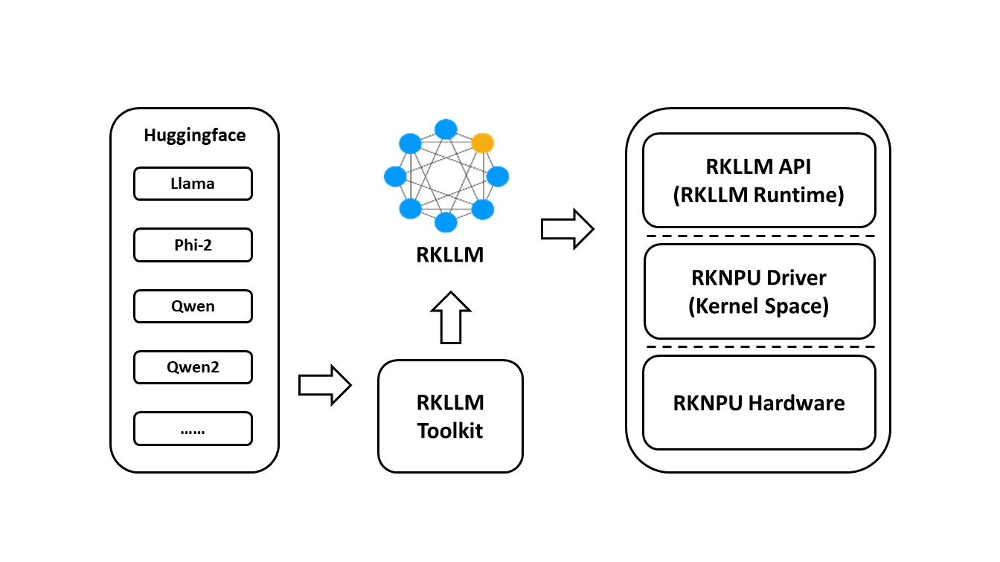

# Description

  RKLLM software stack can help users to quickly deploy AI models to Rockchip chips. The overall framework is as follows:
    <center class="half">
        <div style="background-color:#ffffff;">
        
    </center>

  In order to use RKNPU, users need to first run the RKLLM-Toolkit tool on the computer, convert the trained model into an RKLLM format model, and then inference on the development board using the RKLLM C API.

- RKLLM-Toolkit is a software development kit for users to perform model conversionand quantization on PC.

- RKLLM Runtime provides C/C++ programming interfaces for Rockchip NPU platform to help users deploy RKLLM models and accelerate the implementation of LLM applications.

- RKNPU kernel driver is responsible for interacting with NPU hardware. It has been open source and can be found in the Rockchip kernel code.

# Support Platform

- RK3588 Series
- RK3576 Series
- RK3562 Series

# Support Models

- [x] [LLAMA models](https://huggingface.co/meta-llama) 
- [x] [TinyLLAMA models](https://huggingface.co/TinyLlama) 
- [x] [Qwen models](https://huggingface.co/models?search=Qwen/Qwen)
- [x] [Phi models](https://huggingface.co/models?search=microsoft/phi)
- [x] [ChatGLM3-6B](https://huggingface.co/THUDM/chatglm3-6b/tree/103caa40027ebfd8450289ca2f278eac4ff26405)
- [x] [Gemma2](https://huggingface.co/collections/google/gemma-2-release-667d6600fd5220e7b967f315)
- [x] [Gemma3](https://huggingface.co/collections/google/gemma-3-release-67c6c6f89c4f76621268bb6d)
- [x] [InternLM2 models](https://huggingface.co/collections/internlm/internlm2-65b0ce04970888799707893c)
- [x] [MiniCPM models](https://huggingface.co/collections/openbmb/minicpm-65d48bf958302b9fd25b698f)
- [x] [TeleChat models](https://huggingface.co/Tele-AI)
- [x] [Qwen2-VL-2B-Instruct](https://huggingface.co/Qwen/Qwen2-VL-2B-Instruct)
- [x] [MiniCPM-V-2_6](https://huggingface.co/openbmb/MiniCPM-V-2_6)
- [x] [DeepSeek-R1-Distill](https://huggingface.co/collections/deepseek-ai/deepseek-r1-678e1e131c0169c0bc89728d)
- [x] [Janus-Pro-1B](https://huggingface.co/deepseek-ai/Janus-Pro-1B)
- [x] [InternVL2-1B](https://huggingface.co/OpenGVLab/InternVL2-1B)
- [x] [Qwen2.5-VL-3B-Instruct](https://huggingface.co/Qwen/Qwen2.5-VL-3B-Instruct)

# Model Performance Benchmark

| llm model      | platform | dtype      | seqlen | max_context | new_tokens | TTFT(ms) | Tokens/s | memory(G) |
| :------------- | :------: | :--------- | :----: | :---------: | :--------: | :------: | :------: | :-------: |
| Qwen2-0.5B     |  RK3562  | w4a16_g128 |   64   |     320     |    256     |   524    |   5.67   |   0.39    |
|                |  RK3562  | w4a8_g32   |   64   |     320     |    256     |   873    |  12.00   |   0.48    |
|                |  RK3562  | w8a8       |   64   |     320     |    256     |   477    |  11.50   |   0.61    |
|                |  RK3576  | w4a16      |   64   |     320     |    256     |   204    |  34.50   |   0.40    |
|                |  RK3576  | w4a16_g128 |   64   |     320     |    256     |   212    |  32.40   |   0.40    |
|                |  RK3588  | w8a8       |   64   |     320     |    256     |    79    |  41.50   |   0.62    |
|                |  RK3588  | w8a8_g128  |   64   |     320     |    256     |   183    |  25.07   |   0.75    |
| TinyLLAMA-1.1B |  RK3576  | w4a16      |   64   |     320     |    256     |   345    |  21.10   |   0.77    |
|                |  RK3576  | w4a16_g128 |   64   |     320     |    256     |   410    |  18.50   |   0.80    |
|                |  RK3588  | w8a8       |   64   |     320     |    256     |   140    |  24.21   |   1.25    |
|                |  RK3588  | w8a8_g512  |   64   |     320     |    256     |   195    |  20.08   |   1.29    |
| Qwen2-1.5B     |  RK3576  | w4a16      |   64   |     320     |    256     |   512    |  14.40   |   1.75    |
|                |  RK3576  | w4a16_g128 |   64   |     320     |    256     |   550    |  12.75   |   1.76    |
|                |  RK3588  | w8a8       |   64   |     320     |    256     |   206    |  16.46   |   2.47    |
|                |  RK3588  | w8a8_g128  |   64   |     320     |    256     |   725    |   7.00   |   2.65    |
| Phi-3-3.8B     |  RK3576  | w4a16      |   64   |     320     |    256     |   975    |   6.60   |   2.16    |
|                |  RK3576  | w4a16_g128 |   64   |     320     |    256     |   1180   |   5.85   |   2.23    |
|                |  RK3588  | w8a8       |   64   |     320     |    256     |   516    |   7.44   |   3.88    |
|                |  RK3588  | w8a8_g512  |   64   |     320     |    256     |   610    |   6.13   |   3.95    |
| ChatGLM3-6B    |  RK3576  | w4a16      |   64   |     320     |    256     |   1168   |   4.62   |   3.86    |
|                |  RK3576  | w4a16_g128 |   64   |     320     |    256     |   1583   |   3.82   |   3.96    |
|                |  RK3588  | w8a8       |   64   |     320     |    256     |   800    |   4.95   |   6.69    |
|                |  RK3588  | w8a8_g128  |   64   |     320     |    256     |   2190   |   2.70   |   7.18    |
| Gemma2-2B      |  RK3576  | w4a16      |   64   |     320     |    256     |   628    |   8.00   |   3.63    |
|                |  RK3576  | w4a16_g128 |   64   |     320     |    256     |   776    |   7.40   |   3.63    |
|                |  RK3588  | w8a8       |   64   |     320     |    256     |   342    |   9.67   |   4.84    |
|                |  RK3588  | w8a8_g128  |   64   |     320     |    256     |   1055   |   5.49   |   5.14    |
| InternLM2-1.8B |  RK3576  | w4a16      |   64   |     320     |    256     |   475    |  13.30   |   1.59    |
|                |  RK3576  | w4a16_g128 |   64   |     320     |    256     |   572    |  11.95   |   1.62    |
|                |  RK3588  | w8a8       |   64   |     320     |    256     |   206    |  15.66   |   2.38    |
|                |  RK3588  | w8a8_g512  |   64   |     320     |    256     |   298    |  12.66   |   2.45    |
| MiniCPM3-4B    |  RK3576  | w4a16      |   64   |     320     |    256     |   1397   |   4.80   |   2.70    |
|                |  RK3576  | w4a16_g128 |   64   |     320     |    256     |   1645   |   4.39   |   2.80    |
|                |  RK3588  | w8a8       |   64   |     320     |    256     |   702    |   6.15   |   4.65    |
|                |  RK3588  | w8a8_g128  |   64   |     320     |    256     |   1691   |   3.42   |   5.06    |
| llama3-8B      |  RK3576  | w4a16      |   64   |     320     |    256     |   1608   |   3.60   |   5.63    |
|                |  RK3576  | w4a16_g128 |   64   |     320     |    256     |   2010   |   3.00   |   5.76    |
|                |  RK3588  | w8a8       |   64   |     320     |    256     |   1128   |   3.79   |   9.21    |
|                |  RK3588  | w8a8_g512  |   64   |     320     |    256     |   1281   |   3.05   |   9.45    |

| multimodal model | image input size | vision model dtype | vision infer time(s) | vision memory(MB) | llm model dtype | seqlen | max_context | new_tokens | TTFT(ms) | Tokens/s | llm memory(G) | platform |
|:-------------- |:---------- |:------:|:-----------:|:----------:|:--------:|:--------:|:---------:|:--------:|:---------:|:---------:|:---------:|:---------:|
| Qwen2-VL-2B | (1, 3, 392, 392) | fp16 | 3.55 | 1436.52 | w4a16 | 256 | 384 | 128 | 2094.17 | 13.23 | 1.75 | RK3576 |
|                              |    | fp16  | 3.28 | 1436.52 | w8a8 | 256 | 384 | 128 | 856.86 | 16.19 | 2.47 | RK3588 |
| MiniCPM-V-2_6 | (1, 3, 448, 448) | fp16 | 2.40 | 1031.30 | w4a16 | 128 | 256 | 128 | 2997.70 | 3.84 | 5.50 | RK3576 |
|                            |    | fp16  | 3.27 | 976.98 | w8a8 | 128 | 256 | 128 | 1720.60 | 4.13 | 8.88 | RK3588 |

- This performance data were collected based on the maximum CPU and NPU frequencies of each platform. 
- The script for setting the frequencies is located in the scripts directory.
- The vision model were tested based on all NPU core with rknn-toolkit2 version 2.2.0.

# **Performance Testing Methods**

1. Run the frequency-setting script from the `scripts` directory on the target platform.
2. Execute `export RKLLM_LOG_LEVEL=1` on the device to log model inference performance and memory usage.
3. Use the `eval_perf_watch_cpu.sh` script to measure CPU utilization.
4. Use the `eval_perf_watch_npu.sh` script to measure NPU utilization.

# Download

1. You can download the **latest package** from [RKLLM_SDK](https://console.zbox.filez.com/l/RJJDmB), fetch code: rkllm
2. You can download the **converted rkllm model**  from [rkllm_model_zoo](https://console.box.lenovo.com/l/l0tXb8), fetch code: rkllm

# Examples

1. Multimodel deployment demo:   [Qwen2-VL-2B_Demo](https://github.com/airockchip/rknn-llm/tree/main/examples/Qwen2-VL-2B_Demo)
2. API usage demo:  [DeepSeek-R1-Distill-Qwen-1.5B_Demo](https://github.com/airockchip/rknn-llm/tree/main/examples/DeepSeek-R1-Distill-Qwen-1.5B_Demo)
3. API server demo:  [rkllm_server_demo](https://github.com/airockchip/rknn-llm/tree/main/examples/rkllm_server_demo)
4. Multimodal_Interactive_Dialogue_Demo  [Multimodal_Interactive_Dialogue_Demo](https://github.com/airockchip/rknn-llm/tree/main/examples/Multimodal_Interactive_Dialogue_Demo)

# Note

- The supported Python versions are:

  - Python 3.8
  - Python 3.9
  - Python 3.10
  - Python 3.11
  - Python 3.12

**Note: Before installing package in a Python 3.12 environment, please run the command:**

```
export BUILD_CUDA_EXT=0
```
- On some platforms, you may encounter an error indicating that **libomp.so** cannot be found. To resolve this, locate the library in the corresponding cross-compilation toolchain and place it in the board's lib directory, at the same level as librkllmrt.so.
- Latest version: [ <u>v1.2.0](https://github.com/airockchip/rknn-llm/releases/tag/release-v1.2.0)</u>

# RKNN Toolkit2

If you want to deploy additional AI model, we have introduced a SDK called RKNN-Toolkit2. For details, please refer to:

https://github.com/airockchip/rknn-toolkit2

# CHANGELOG

## v1.2.0

- Supports custom model conversion.
- Supports chat_template configuration.
- Enables multi-turn dialogue interactions.
- Implements automatic prompt cache reuse for improved inference efficiency.
- Expands maximum context length to 16K.
- Supports embedding flash storage to reduce memory usage.
- Introduces the GRQ Int4 quantization algorithm.
- Supports GPTQ-Int8 model conversion.
- Compatible with the RK3562 platform.
- Added support for visual multimodal models such as InternVL2, Janus, and Qwen2.5-VL.
- Supports CPU core configuration.
- Added support for Gemma3
- Added support for Python 3.9/3.11/3.12

for older version, please refer [CHANGELOG](CHANGELOG.md)