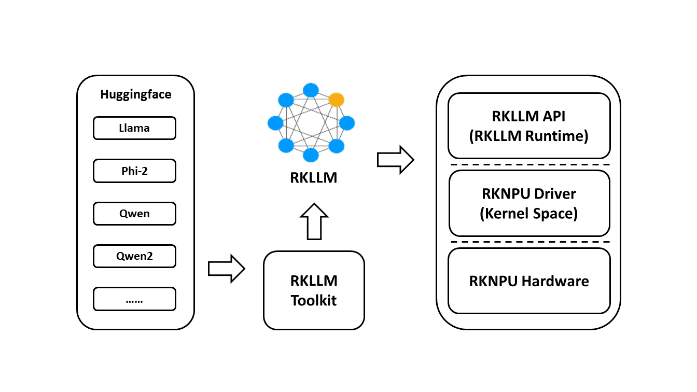

# Description

  RKLLM software stack can help users to quickly deploy AI models to Rockchip chips. The overall framework is as follows:
    <center class="half">
        <div style="background-color:#ffffff;">
        
    </center>

  In order to use RKNPU, users need to first run the RKLLM-Toolkit tool on the computer, convert the trained model into an RKLLM format model, and then inference on the development board using the RKLLM C API.

- RKLLM-Toolkit is a software development kit for users to perform model conversionand quantization on PC.

- RKLLM Runtime provides C/C++ programming interfaces for Rockchip NPU platform to help users deploy RKLLM models and accelerate the implementation of LLM applications.

- RKNPU kernel driver is responsible for interacting with NPU hardware. It has been open source and can be found in the Rockchip kernel code.

# Support Platform

- RK3588 Series
- RK3576 Series
- RK3562 Series
- RV1126B Series

# Support Models

- [x] [LLAMA models](https://huggingface.co/meta-llama) 
- [x] [TinyLLAMA models](https://huggingface.co/TinyLlama) 
- [x] [Qwen2/Qwen2.5/Qwen3/Qwen3.5](https://huggingface.co/Qwen)
- [x] [Phi2/Phi3](https://huggingface.co/microsoft)
- [x] [ChatGLM3-6B](https://huggingface.co/THUDM/chatglm3-6b/tree/103caa40027ebfd8450289ca2f278eac4ff26405)
- [x] [Gemma2/Gemma3/Gemma3n/Gemma4](https://huggingface.co/google)
- [x] [InternLM2 models](https://huggingface.co/collections/internlm/internlm2-65b0ce04970888799707893c)
- [x] [MiniCPM3/MiniCPM4](https://huggingface.co/openbmb)
- [x] [TeleChat2](https://huggingface.co/Tele-AI)
- [x] [Qwen2-VL/Qwen3-VL](https://huggingface.co/Qwen)
- [x] [MiniCPM-V-2_6](https://huggingface.co/openbmb/MiniCPM-V-2_6)
- [x] [DeepSeek-R1-Distill](https://huggingface.co/collections/deepseek-ai/deepseek-r1-678e1e131c0169c0bc89728d)
- [x] [Janus-Pro-1B](https://huggingface.co/deepseek-ai/Janus-Pro-1B)
- [x] [InternVL2-1B/InternVL3-1B](https://huggingface.co/OpenGVLab)
- [x] [SmolVLM/SmolLM3](https://huggingface.co/HuggingFaceTB)
- [x] [RWKV7](https://huggingface.co/fla-hub)
- [x] [DeepSeekOCR](https://huggingface.co/deepseek-ai/DeepSeek-OCR)

# Quickstart

The easiest way to try it yourself is to download our multimodal vision model example, this demo runs entirely on your local device using **RKNN** (for vision) and **RKLLM** (for language). you can use your own images and ask questions about them. with **RKLLM**, all processing happens locally on your device-your data never leaves it.

1. Download the pre-converted models and the demo executable (located in the `quickstart` directory) from the following [rkllm_model_zoo](https://console.box.lenovo.com/l/l0tXb8), use the fetch code: `rkllm`.

2.  Open a terminal and push the demo and model files to your local device:

```bash
adb push ./demo_Linux_aarch64 /data
adb push model.rkllm /data/demo_Linux_aarch64
adb push model.rknn /data/demo_Linux_aarch64
```

3. Enter the demo directory and set up environment variables:

```bash
adb shell
cd /data/demo_Linux_aarch64
export LD_LIBRARY_PATH=./lib
```

4. Run the demo

```bash
Usage: ./demo image_path encoder_model_path llm_model_path max_new_tokens max_context_len rknn_core_num platform [img_start] [img_end] [img_content]

# for Qwen2.5-VL
./demo demo.jpg ./qwen2_5_vl_3b_vision_rk3588.rknn ./qwen2.5-vl-3b-w8a8_level1_rk3588.rkllm 2048 4096 3 rk3588 "<|vision_start|>" "<|vision_end|>" "<|image_pad|>"

# for Qwen3-VL
./demo demo.jpg ./qwen3-vl-2b_vision_rk3588.rknn ./qwen3-vl-2b-instruct_w8a8_rk3588.rkllm 2048 4096 3 rk3588 "<|vision_start|>" "<|vision_end|>" "<|image_pad|>"

# for Qwen3.5
./demo demo.jpg ./Qwen3.5-0.8B_vision_rk3588.rknn ./Qwen3.5-0.8B_w8a8_rk3588.rkllm 2048 4096 3 rk3588 "<|vision_start|>" "<|vision_end|>" "<|image_pad|>"

# for InternVL3
./demo demo.jpg ./internvl3-1b_vision_fp16_rk3588.rknn ./internvl3-1b_w8a8_rk3588.rkllm 2048 4096 3 rk3588 "" "</img>" "<IMG_CONTEXT>"

# for DeepSeekOCR
./demo demo.jpg ./deepseekocr_vision_rk3588.rknn ./deepseekocr_w8a8_rk3588.rkllm 2048 4096 3 rk3588 "" "" "<｜▁pad▁｜>"
```

   `[img_start]`, `[img_end]`, and `[img_content]` need to be checked in the model’s configuration file.

   For example, in **InternVL3**, you can find them in `modeling_internvl_chat.py` as shown below:

   ```
   def chat(self, tokenizer, pixel_values, question, generation_config, history=None, return_history=False,
            num_patches_list=None, IMG_START_TOKEN='', IMG_END_TOKEN='</img>', IMG_CONTEXT_TOKEN='<IMG_CONTEXT>',
            verbose=False):
   ```

# Model Performance

1.  [Benchmark](https://github.com/airockchip/rknn-llm/tree/main/benchmark.md) results of common LLMs.

# **Performance Testing Methods**

1. Run the frequency-setting script from the `scripts` directory on the target platform.
2. Execute `export RKLLM_LOG_LEVEL=1` on the device to log model inference performance and memory usage.
3. Use the `eval_perf_watch_cpu.sh` script to measure CPU utilization.
4. Use the `eval_perf_watch_npu.sh` script to measure NPU utilization.

# Download

1. You can download the **latest package** from [RKLLM_SDK](https://console.zbox.filez.com/l/RJJDmB), fetch code: rkllm
2. You can download the **converted rkllm model**  from [rkllm_model_zoo](https://console.box.lenovo.com/l/l0tXb8), fetch code: rkllm

# Examples

1. Multimodal deployment demo:   [multimodal_model_demo](https://github.com/airockchip/rknn-llm/tree/main/examples/multimodal_model_demo)
2. API usage demo:  [rkllm_api_demo](https://github.com/airockchip/rknn-llm/tree/main/examples/rkllm_api_demo)
3. API server demo:  [rkllm_server_demo](https://github.com/airockchip/rknn-llm/tree/main/examples/rkllm_server_demo)

# Note

- The supported Python versions are:

  - Python 3.9
  - Python 3.10
  - Python 3.11
  - Python 3.12

**Note: Before installing package in a Python 3.12 environment, please run the command:**

```
export BUILD_CUDA_EXT=0
```
- On some platforms, you may encounter an error indicating that **libomp.so** cannot be found. To resolve this, locate the library in the corresponding cross-compilation toolchain and place it in the board's lib directory, at the same level as librkllmrt.so.
- RWKV model conversion only supports Python 3.12. Please use `requirements_rwkv7.txt` to set up the pip environment.
- Latest version: [ <u>v1.3.0](https://github.com/airockchip/rknn-llm/releases/tag/release-v1.3.0)</u>

# RKNN Toolkit2

If you want to deploy additional AI model, we have introduced a SDK called RKNN-Toolkit2. For details, please refer to:

https://github.com/airockchip/rknn-toolkit2

# CHANGELOG

## v1.3.0

- Added support for Qwen3.5, Gemma4, and SmolLM3 models.
- Optimized the multimodal input interface and cache reuse strategy.
- Added support for multiple EOS token IDs and introduced the ignore_eos_token parameter.
- Optimized performance on 32-bit systems.
- Added support for tokenizer and embedding callbacks.
- Improved long-context decoding performance for certain models on the RK3576 platform.
- Optimized the quantization method for embedding input data.
- Fixed memory usage statistics issues on the RV1126B platform.
- Fixed numerical overflow issues during inference for certain models on the RK3588 platform.
- Improved  rkllm_server_demo compatibility with OpenAI API interfaces.
- Added support for overriding max_new_tokens and sampling parameters in RKLLMInferParam

for older version, please refer [CHANGELOG](CHANGELOG.md)